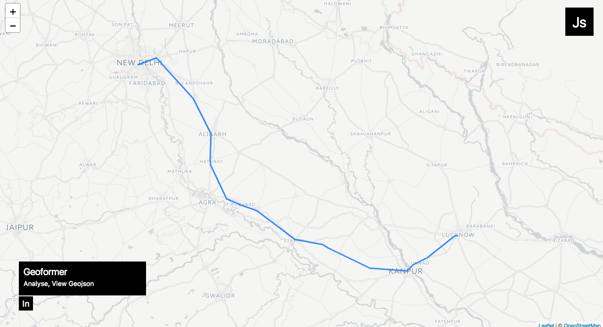

# Geoformer 🌏

_Create, Analyse, Lint Geojson_

#### Screenshot

#### Live at

<https://rajatsharma305.github.io/geoformer/#/>

#### Features

* Analyse Geojson
* Edit Geojson and View results on the fly

#### Installation and Development

- `npm i or yarn install` to install dependencies.
- `npm start or yarn start` to start development server.
- `npm build` to build project.
- `npm deploy` to deploy to `gh-pages`.
